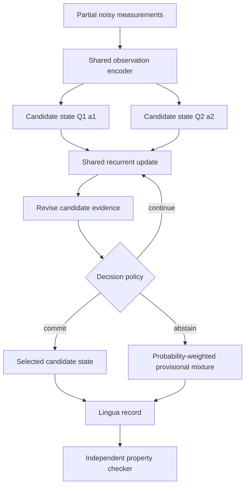

# Architecture: one executable system, separable claims

## Responsibilities

| Component | Responsible for | Not responsible for |
|---|---|---|
| Candidate bases | Keeping each candidate state in a declared subspace | Showing that the candidate is appropriate |
| Shared update | Refining candidate coordinates | Certifying optimality |
| Evidence scorer | Revising route probabilities | Guaranteeing calibration |
| Decision policy | Trading commitment, computation, and abstention under declared costs | Discovering universally correct costs |
| Lingua | Recording explicit states, evidence, decisions, and checks | Inventing semantic stories for hidden units |
| Checker | Recomputing declared arithmetic and structural properties | Replaying the neural network or attesting remote execution |

## Relationship to the earlier repos

HOMYMOLY provides narrow evidence that the right known structure can improve a tested estimator. Universa supplies the larger ambition of routing, transporting, projecting, and discovering structures. Applied CMCM asks when retaining a witness is worth its cost.

This repo combines those questions operationally, but it does not import their conclusions wholesale. Neural v2 maintains parallel hypotheses in equal-dimensional toy subspaces. It does not yet implement a general Universa chain-map transport or discovery loop.
