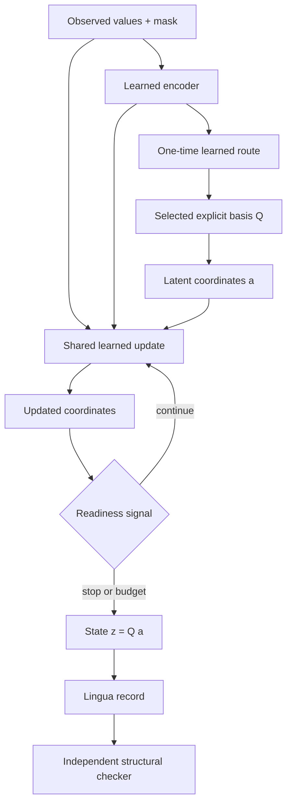

# Architecture: what is genuinely connected

## Current learned path



In words:

1. encode a partial noisy observation;
2. choose one of two known constraint spaces;
3. carry a small coordinate state inside that space;
4. reuse one learned update for several steps;
5. stop from a learned signal or a hard budget;
6. emit an estimate and a scoped mathematical record.

## What came from where

| Source | Real connection in this repo | Connection that does not yet exist |
|---|---|---|
| **HOMYMOLY** | Motivates testing exact structural restrictions against generic estimation | Its lifting result is not a proof that this architecture helps |
| **Universa** | Structural spaces, transport/project language, optional pinned adapter | The current neural model does not use Universa's discovery loop or switch structures after step 0 |
| **Recurrent computation** | One update network is reused over a persistent coordinate state | Repetition is not automatically useful or faster |
| **Lingua** | Records explicit selected structures and measurable state dynamics | It does not translate arbitrary hidden features into human concepts |
| **Applied CMCM** | Motivates asking which parts of a computational record are worth retaining | Its earlier witness results do not settle this new task |

## The most important missing connection

Current inference chooses a structure once:

```text
route once → recur inside that space
```

The larger research idea is:

```text
recur → detect mismatch → transport or revise route → continue
```

That requires persistent typed states, safe transport between spaces, uncertainty
retention, and tests showing that switching does not destroy evidence. It is Stage
3, not something the present two-structure demo has already achieved.

## Two adaptive execution paths

| Path | What it does | Honest interpretation |
|---|---|---|
| `dense` | Updates the full batch every round and freezes logically halted states | Regular GPU work; mean logical steps may not save compute |
| `compact` | Gathers only active samples before each later update | Fewer update examples, but indexing overhead can erase the gain |

Only wall-clock measurement at comparable quality supports an efficiency claim.

## Why the direct method stays

The toy task is a constrained quadratic problem. A direct solver exists and may
be better. Its role is not ceremonial: it prevents a learned recurrent system
from receiving credit merely for solving a problem that linear algebra already
solves cheaply.
