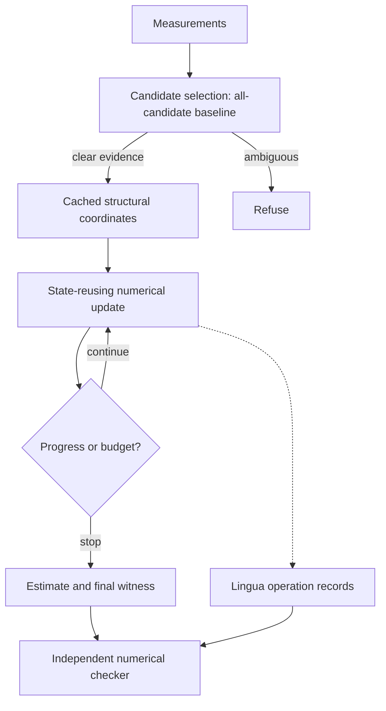

# Architecture: one system, separable claims

Fallback in words: measurements → choose a candidate → compile its coordinates →
repeat an update → return an estimate and evidence. Ambiguity leads to refusal.

| Layer | Current contract | Future extension |
|---|---|---|
| Structure | B describes homogeneous linear constraints | Affine constraints, typed transport between spaces |
| Selector | Score all candidates using validation observations | Learned inexpensive selection with uncertainty |
| Update | Reuse a small coordinate state; classical quadratic optimization | Trained shared-weight nonlinear updates |
| Stopping | Numerical stationarity or hard iteration cap | Task-calibrated stopping under measured compute budgets |
| Lingua | Explicit operation names and retained evidence | Extensible typed operation registry |
| Checker | Matrix-vector checks of specific claims | Formal/sparse checkers for additional operations |

## Connections that are real, and those that are not yet built

HOMYMOLY motivates using the right constraints; its results do not guarantee a
benefit on this new task. Universa provides structural machinery via an optional
adapter, but this demo does not use its learned router or discovery loop. Applied
CMCM supplies questions about retaining computational records, not a theorem that
our compact records are sufficient for every audit.

Learned recurrence and general neural interpretability are not implemented. A
small correct solver is a foundation for those experiments, not evidence that they
will work. [Claims ledger](claims.md) records the distinction.

## Why a separate repo?

Update, trace schema, and checker changes can be reviewed together. Earlier
research repos retain their own implementation and experiment history. The
optional Universa dependency is pinned; its source is not copied here.
