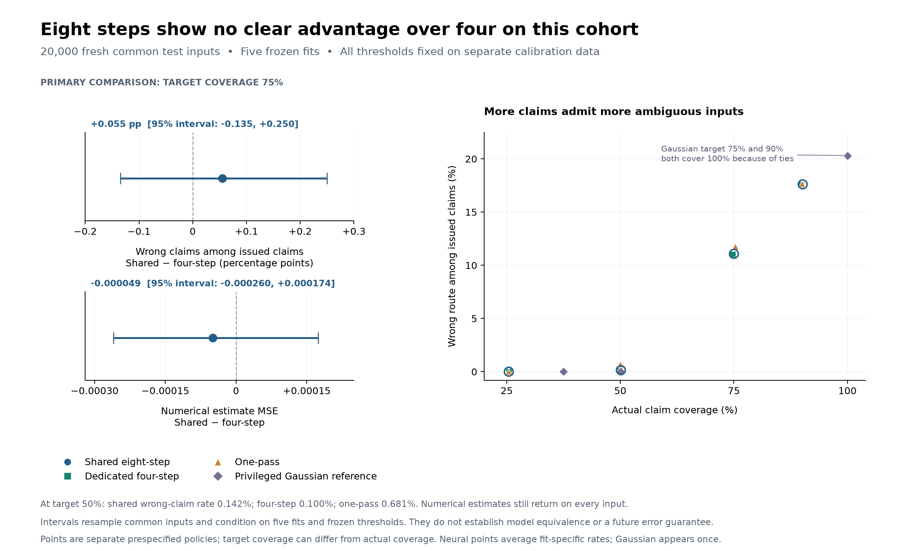

# Claim reliability on 20,000 fresh inputs

An inspection system can make fewer automatic decisions and refer uncertain
cases for review. The key question is how many wrong decisions remain among
the cases it accepts. This study tests that tradeoff for structural claims,
separately from numerical-estimate quality and mathematical receipt validity.

**The prespecified primary comparison does not establish an advantage for eight
steps over four.** At a 75% target claim coverage, shared eight-step has 11.0719%
wrong claims and dedicated four-step has 11.0166%. Their paired difference is
**+0.0553 percentage points**, with a 95% interval of **[-0.1349, +0.2502]**.
Negative would favor shared. The interval spans zero; no equivalence margin was
specified, so this is not a demonstration that the models are equivalent.

The larger practical finding is the coverage tradeoff: at the prespecified 50%
target, four-step has **0.0999%** wrong claims and shared has **0.1416%**, while
actually claiming on about half of the inputs. These are observed conditional
errors on this synthetic cohort, not guaranteed future error bounds.



## What was fixed before the run

The run used the [committed protocol](claim_reliability.md), source commit
`f57778c47dfa245158d6cee91261493dd1ee7716`, five existing checkpoint fits, 5,000
new calibration inputs (seed 41000), and 20,000 new common test inputs (seed
42000). The four coverage targets were 25%, 50%, 75% and 90%. All models' policies
were saved in the global calibration lock before the reported test phase.
The returned archive records a complete full run, not a smoke test.

Model weights, trained depths, candidate structures and numerical-estimate
semantics were unchanged. Calibration chooses the largest inclusive confidence
cutoff retaining at least the requested fraction; it uses probabilities without
labels. The claim threshold does not change the mixture estimate returned
on every input. The [protocol](../experiments/claim_reliability_v1.json) defines
the primary statistic, tie rule and stopping rule; it remains unchanged here.

This is selective classification in the sense of
[Geifman and El-Yaniv](https://arxiv.org/abs/1705.08500). The confidence cutoff
controls a target frequency of claims, not a guaranteed probability of a correct
claim. A claim chooses a synthetic generating label; a receipt check establishes
different mathematical properties.

## Primary target: 75% claim coverage

Rows are arithmetic means of five fit-specific metrics. Wrong-claim rates are
averaged as per-fit ratios, not obtained by pooling all claimed cases.

| Model | Actual claim coverage | Wrong among claims | Estimate MSE | Top-route accuracy |
|---|---:|---:|---:|---:|
| Shared eight-step | 75.006% | 11.0719% | 0.04698184 | 79.179% |
| Dedicated four-step | 74.788% | 11.0166% | 0.04703128 | 79.156% |
| One-pass | 75.276% | 11.7545% | 0.04920906 | 79.208% |

| Shared minus four-step | Point estimate | Paired 95% percentile interval |
|---|---:|---:|
| Wrong-claim rate | +0.055279 percentage points | [-0.134867, +0.250184] percentage points |
| Actual coverage | +0.218000 percentage points | [+0.022000, +0.428025] percentage points |
| Estimate MSE | -0.000049446 | [-0.000260453, +0.000174132] |

Shared issues slightly more claims on average. Its mean reconstruction MSE is
0.105% lower than four-step, but the paired MSE interval also spans zero. The
conditional-error point difference favors four-step in all five fitted pairs;
MSE favors shared in three pairs and four-step in two. They share one test
cohort, so those five point comparisons are not five independent test datasets.

Both recurrent models have lower MSE than one-pass in all five fitted pairs.
The mean reduction is 4.526% for shared and 4.426% for four-step. These numerical
estimate comparisons were secondary outcomes and do not establish a general
causal benefit of recurrence, architecture superiority, or performance outside
this synthetic distribution.

The bootstrap resampled the same 20,000 input indices across both primary
models and all five fits, 2,000 times. Each replicate recomputed every fit's
conditional ratio before averaging the differences. All replicates were defined.
Intervals condition on these five fits and their frozen calibration policies;
they exclude training-run and calibration-sample uncertainty. Secondary outcomes
have no multiplicity adjustment. The five fits do not create 100,000 independent
test observations.

## The useful operating tradeoff

This sweep was specified before the test, but remains a descriptive secondary
analysis. Each cell shows actual coverage followed by wrong claims among claims.

| Target | Shared eight-step | Dedicated four-step | One-pass |
|---:|---:|---:|---:|
| 25% | 25.456% / 0 observed errors | 25.483% / 0 observed errors | 25.428% / 0.0079% |
| 50% | 50.126% / 0.1416% | 50.023% / 0.0999% | 49.950% / 0.6806% |
| 75% | 75.006% / 11.0719% | 74.788% / 11.0166% | 75.276% / 11.7545% |
| 90% | 90.152% / 17.6040% | 89.898% / 17.5607% | 89.963% / 17.6780% |

At the 50% target, four-step wrong-claim counts across the five fits are
11, 13, 14, 4 and 8 out of approximately 10,000 claims per fit. Shared counts
are 11, 4, 28, 11 and 17; one-pass counts are 76, 54, 51, 67 and 92.
The remaining inputs still receive numerical estimates; their structural claims
are withheld. The coverage sacrifice is substantial and must accompany the low
conditional-error figures. Zero observed errors at 25% is not zero population
risk: even the per-fit Wilson upper bounds are nonzero.

The earlier post-hoc 256-input cohort estimated shared wrong-claim error at
13.4%. The new 11.07% value uses a different cohort and new calibration thresholds;
it is not evidence that training improved the unchanged model.

## The analytic reference reveals an information limit

The Gaussian reference knows the synthetic prior and observation noise. It has
full-cohort MSE **0.04427450**, top-route accuracy **79.69%**, Brier score
**0.217467** and negative log likelihood **0.307280**. It is evaluated once in
CPU float64 and reused in the five reports, not five independently fitted models.

Its nominal coverage settings need special interpretation:

| Target | Frozen confidence cutoff | Actual coverage | Wrong / claims |
|---:|---:|---:|---:|
| 25% | 1.0 | 37.490% | 0 / 7,498 |
| 50% | 0.995839465273308 | 50.085% | 0 / 10,017 |
| 75% | 0.5 | 100.000% | 4,062 / 20,000 |
| 90% | 0.5 | 100.000% | 4,062 / 20,000 |

The following explanation is a post-hoc diagnostic; no test policy was changed.
For the local regenerated library, the two structures' Gaussian covariance
matrices differ only in correlations involving the fifth ambient coordinate.
When that coordinate is unobserved, the observed marginal distributions are
identical. Under the equal-prior Gaussian model, neither label is favored.

Exactly **5,807 test inputs (29.035%)** have that mask condition. All and only
those inputs have saved Gaussian probabilities `(0.5, 0.5)`. First-index tie
breaking makes 2,880 of their 5,807 route choices wrong, or 49.595%. Extra
iterations cannot identify the generating label from these observed values
under the assumed model.

A threshold strictly above 0.5 can cover at most 70.965% of these test inputs.
The prespecified inclusive rule therefore jumps to 100% coverage for both the
75% and 90% targets. Its 20.31% error cannot be compared with the neural rows
as if both operated at 75% actual coverage. At the other end, float64 confidence
scores saturating at exactly 1.0 explain the nominal 25% target's overshoot.
Stored probability one and zero observed errors are not certainty guarantees.
Any future tie-handling change needs a new protocol and fresh evaluation data.

## What was independently replayed, and what remains unverified

The numerical audit reads saved NPZ arrays with pickle disabled and imports no
producer/model analysis code. It recomputes calibration order statistics,
per-fit metric arithmetic, summary aggregation and the prespecified bootstrap
using separate formulas, with 5,346 scalar/equality comparisons and no
discrepancies. All 80 saved model/fit/coverage policies match exactly
across calibration, lock and test reports. Integer counts match exactly; metric
differences are below 1.2e-16 and bootstrap interval differences below 2.7e-18.

The separate provenance audit checks all 23 ZIP members, 22 summary artifact
hashes and 100 numeric array identities. The protocol matches its committed
bytes; the package-source hash and four script hashes match the supplied source.
All five reported checkpoint/previous-calibration hash pairs match the preceding
verified-pipeline archive. Calibration locks and file timestamps are consistent
with the source's calibration-before-test barrier. They do not independently
authenticate chronology or execution.

Both complete datasets regenerate bit for bit: observed values, masks, clean
truth and labels match across every archived fit. All 25,000 calibration/test
inputs are distinct, with zero overlap. Independent Gaussian calculation using
the observed-coordinate covariance directly agrees with saved probabilities
within 1.22e-13 and mixture estimates within 1.38e-13; every route and held-fixed
test claim decision agrees.

There is one unresolved byte-provenance limitation. The locally regenerated basis
hash is `f76944965521311a055139ee5a22578975f96f3fe5220c8e01522dc3fa55e5e6`,
while the reported checkpoint basis hash is
`c5f113ea993a43014edcfcfe2a20aa270e238889b566251652d67c804baed529`.
Boundary bytes match. Actual checkpoint basis values were not uploaded, so the
cause of the hash difference cannot be established. Platform-dependent numerical
basis construction is plausible, but is not demonstrated by the hashes. Exact
dataset reproduction and the numerical Gaussian agreement above still hold.

Neural checkpoint weights and GPU prediction generation were not locally
replayed. This experiment does not add receipt-property checks, a verified-request
latency measurement, an error-risk guarantee or evidence about real-world tasks.

## Research decision

Keep dedicated four-step as the practical working baseline, while retaining the
eight-step comparator. Its lower inference cost was measured in the separate
[pipeline study](verified_pipeline_20260911.md); this quality run supplies no
clear compensating eight-step gain. That is an engineering judgment conditional
on the present evidence, not a proof of equivalence.

The coverage/error relationship is now a concrete result worth preserving.
A reliability-focused demonstration can explore the already measured 50% target
while showing its substantial abstention rate and observed, rather than
guaranteed, error. No additional DGX run is needed to finish this analysis.

## Artifacts

The [recomputed metrics](../experiments/results/claim_reliability_20260911.json),
[data/reference audit](../experiments/results/claim_reliability_data_20260911.json)
and [provenance audit](../experiments/results/claim_reliability_provenance_20260911.json)
preserve exact counts, differences and limitations. Recompute numerical results
with NumPy and the uploaded archive:

```bash
python scripts/audit_claim_reliability.py /path/to/claim-reliability-reports.zip /path/to/new-audit-output
```

The auditor has 23 focused regression tests for altered metrics, threshold ties,
paired resampling, undefined rates and malformed array/archive inputs. The full
local suite passed 503 tests, with three CUDA checks and one optional upstream
integration check skipped. This results update changes no producer, neural-model
or protocol code.

- Archive: `claim-reliability-20260911-223944-FTvvdn-reports.zip`.
- Archive SHA-256: `6681c6217f7704091e5e4f1bcf2136f53360c6bed5e88ba1c724c589545222b8`.
- Calibration data SHA-256: `eb805f71cd0227df6e0e0d6d1e4c10b026250dfe87e9ab6ca83f6b4608b58bbe`.
- Test data SHA-256: `8ec9ae9e72f1699846db1994b2a7cc6b132551a551c251fc1228f2b15f509b9b`.
- NVIDIA GB10; CUDA 13.0; PyTorch 2.14.0+cu130; Python 3.11.14; NumPy 2.4.6.
- Deterministic algorithms enabled, TF32 disabled; package version 0.5.2.
