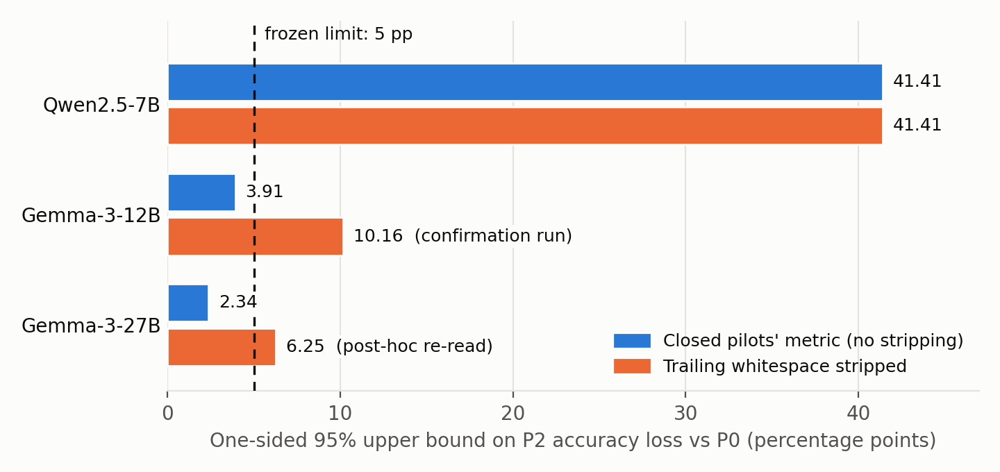

<!--
Number-trace sources. tests/test_paper_numbers.py checks that every
nontrivial number in this file appears verbatim in at least one of these
committed files. Add a source here before citing a new number.

sources:
  docs/phase_two_results.md
  docs/phase_two_technical_report.md
  docs/claims.md
  research/open_weight_lingua/README.md
  research/open_weight_lingua/protocols/phase_two_brief.md
  research/open_weight_lingua/protocols/pilot_decision.md
  research/open_weight_lingua/protocols/gemma_answer_convention.md
  research/open_weight_lingua/reports/gemma3_pilot.md
  research/open_weight_lingua/reports/gemma3_27b_pilot.md
  research/open_weight_lingua/reports/gemma3_12b_confirmation.md
  research/open_weight_lingua/reports/gemma3_27b_confirmation.md
  research/open_weight_lingua/reports/edit_eligibility_structure.md
  research/open_weight_lingua/reports/edit_channel_diagnostics.md
  research/open_weight_lingua/reports/post_hoc_answer_lens.md
  research/open_weight_lingua/reports/steering_assay.md
  research/open_weight_lingua/reports/nla_ecosystem_notes.md
-->

# Do natural-language descriptions of activations preserve behavior?

**A frozen-protocol evaluation of released NLA pairs on three open-weight models**

Sean Mahdavian · ORCID <https://orcid.org/0009-0000-8432-7825> ·
[universa-recurrent](https://github.com/seanm27lol/universa-recurrent)

*Draft, not peer reviewed. Every number below comes from a committed report and
is checked against it by `tests/test_paper_numbers.py`.*

## Abstract

Natural language autoencoders (NLAs) pair an *activation verbalizer* (AV), which
describes one internal activation of a language model in English, with an
*activation reconstructor* (AR), which turns that English back into a vector
(Fraser-Taliente, Kantamneni, Ong et al., 2026). If the English carries what the
model is computing, swapping a vector for its reconstruction should leave the
model's behavior intact, and editing the text should change behavior in a
targeted way. We assessed preservation and edit feasibility on the three released
NLA pairs that fit our hardware, for Qwen2.5-7B-Instruct, Gemma-3-12B-it and Gemma-3-27B-it, using a
small arithmetic task with paired counterfactuals. Pilot thresholds, controls and
stopping rules were frozen before outcomes were read. All three families fail the
preservation criterion on usable tasks: the one-sided 95% upper bounds on accuracy
loss are 41.4, 10.16 and 6.25 percentage points, respectively, against a 5-point
limit. Both Gemma pilots initially failed usability because the metric rejected
trailing newlines. Confirmation pilots under a frozen metric amendment made the
tasks usable (P0 accuracy 0.9512 and 0.9648), reproduced the post-hoc predictions
exactly, and still decided STOP; their P0 generations were bitwise-identical to
the closed pilots'. A generic PCA reconstruction using no more bytes than the
text stayed close to the unmodified model. Descriptions beat a shuffled control
on every family, but a post-hoc analysis found answer predictions rather than
the variable-state statements the frozen editor requires: coverage remains
0/128 each, and the frozen edit hypothesis remains untested. Seven separately
frozen diagnostics found that consistently rewriting the number in a Gemma-3-12B
AV description moves the answer in about a third of selected receivers. Another
program's description works as well; four hand-written texts do not. This effect
is a property of the AR, the target and the AV's output genre, not evidence that
descriptions read their own activation. A separate Qwen steering assay and a
serving-backend equivalence gate were negative. These results concern one task,
one released layer per model and the tested checkpoints and serving conditions.

## 1. Introduction

Give Qwen2.5-7B-Instruct this prompt:

```text
x = 3
y = 8
x = x + 2
What is x? Reply with only the integer.
```

The answer is 5. Before the model answers, capture one internal vector `h`. Ask
the released AV to describe it in English, ask the paired AR to rebuild a
direction from that English, and put the rebuilt vector back in place of `h`.
Does the model still answer 5? And if the description says something like
"x is currently 5", does editing that text to "6" make the model answer 6?

These two questions, *preservation* and *editability*, are what a behavioral user
of an explanation method needs. A description can read well and reconstruct the
vector with high cosine similarity while still dropping the part of the
computation that matters for the next answer. The NLA paper itself reports
confabulations and layer sensitivity, which makes behavior the right place to
test (Fraser-Taliente et al., 2026).

**Contributions.**

1. **A frozen behavioral assay** for description round trips: a paired
   counterfactual arithmetic task, an adapter-correctness control, a
   wrong-description control, a byte-budgeted numerical baseline, a random
   direction and a raw donor, with decision gates and stopping rules fixed
   before any outcome was read (§3).
2. **Results on three model families** (§4). Each fails the frozen preservation
   criterion on a usable task, while a generic PCA baseline stays close to the
   unmodified model. The descriptions carried task-relevant information on every
   family; the frozen variable-state edit interface never appeared.
3. **A structural explanation and seven edit-channel diagnostics** (§4.4–4.5).
   The descriptions predict answers. Consistent edits move Gemma-3-12B answers
   even when the text comes from another program, limiting the finding to the
   AR, target and AV output genre. Three recorded predictions were wrong in
   whole or in part.
4. **Two other follow-up measurements**, both negative: steering by description
   differences, and equivalence of a faster serving backend (§4.6–4.7).
5. **An instrument-failure case study** (§4.3): the Gemma usability failures
   were a trailing-newline artifact in the answer metric. It was caught post hoc
   and handled by freezing a metric amendment for confirmation pilots. Both
   confirmation pilots reproduced the predicted outcomes exactly, while the
   closed runs retain their original outcomes.

## 2. Background

**Natural language autoencoders.** An NLA's AV and AR are first fine-tuned on
English summaries of activations, then optimized with reinforcement learning so
that the AR can reconstruct `h` from the AV's text (reported as fraction of
variance explained). The authors released
training code and four open-model pairs, each trained at a single layer
(Fraser-Taliente et al., 2026; `kitft/natural_language_autoencoders`). We used
the three that fit a single NVIDIA DGX Spark (GB10, unified memory); the
Llama-3.3-70B pair was excluded because its AV alone (141.12 GB) exceeds the
machine's physical memory.

| Target model | Released NLA pair | Capture site (block / depth) |
|---|---|---|
| Qwen2.5-7B-Instruct | `kitft/nla-qwen2.5-7b-L20-av` / `-ar` | 20 / 28 |
| Gemma-3-12B-it | `kitft/nla-gemma3-12b-L32-av` / `-ar` | 32 / 48 |
| Gemma-3-27B-it | `kitft/nla-gemma3-27b-L41-av` / `-ar` | 41 / 62 |

**Activation patching.** Replacing one activation and measuring the downstream
change is standard practice; its results depend on the metric and the corruption
used, and a patching effect is not by itself a complete causal account (Zhang and
Nanda, 2023). We therefore report several behavioral channels (exact-answer
accuracy, agreement with the unmodified generation, next-token KL, and
correct-answer log probability) alongside explicit controls.

## 3. Method

### 3.1 Task

Short straight-line programs over two variables use initialization,
assignment/copy and addition or subtraction by constants, with 3–6 statements and
reference values in 0–19, evaluated by a small explicit interpreter. Each *group*
pairs a source program with a counterfactual that changes the first assignment
(for example `x = 3` becomes `x = 4`, moving the answer for `x` from 5 to 6 while
the answer for `y` stays 8). Each group contributes four prompt variants
(source/counterfactual × query x/y). Groups, not variants, are the unit of
statistical resampling, because variants within a group are not independent.

### 3.2 Intervention

At the capture site, `h` is the residual-stream output of the stated block at the
last non-padding token, including the assistant-generation prefix. The AV
produces a description `c`; the AR maps `c` to a direction `r`; the installed
replacement is

```text
h' = n · r / ||r||₂,   where n = ||h||₂
```

The norm `n` is a retained four-byte side channel, **not** something recovered
from text; a diagnostic that replaces it with the calibration median norm is
reported alongside. The remaining computation then runs with the original prompt
and all other token vectors untouched.

### 3.3 Conditions

| ID | Intervention | Purpose |
|---|---|---|
| P0 | Unmodified target | Behavioral reference |
| P1 | Reinsert the original activation | Adapter correctness gate |
| P2 | Own description → AR direction + original norm | Main condition |
| P3 | Another group's description → AR direction + receiver norm | Does the *specific* description matter? |
| P4 | Calibration-fitted PCA reconstruction | Generic numerical baseline under a byte budget |
| P5 | Norm-matched random direction | Coarse sensitivity diagnostic |
| donor | Raw activation from the paired counterfactual | Sensitivity of the intended measurement |

P4 fits PCA on unit directions from a separate calibration split, with no task
labels; its rank is capped so that float16 coefficients use no more bytes than
the description's UTF-8 text. When the fitted rank caps storage below that budget,
the comparison is *no-more-than-budget*, not an optimal compression baseline.

### 3.4 Frozen gates

All thresholds below were fixed before any pilot outcome was read.

| Gate | Frozen rule |
|---|---|
| 1. Task usable | P0 exact-answer accuracy at least 80%, and donor/perturbation controls show the site can affect the measurement |
| 2. Limited behavioral preservation | One-sided 95% upper estimate of P2 accuracy loss versus P0 at most 5 percentage points, **and** P2 beats P3 on correct-answer log probability with a positive lower confidence estimate |
| 3. Edit feasibility | At least 32 of the 128 pilot groups contain one unambiguous statement of a variable's current value that the frozen editor can change; otherwise close with preservation-only results |
| Uncertainty | Whole-group bootstrap, 3,000 resamples, fixed seed |

The frozen answer metric counts a generation correct only if it is exactly a
canonical integer: no stripping, so extra whitespace, commentary and leading zeros
are failures.

### 3.5 Stages and stopping rule

Each family ran an 8-group engineering smoke, a 256-group calibration (which fits
P4 and freezes the median norm), and one 128-group pilot. A locked 512-group
validation opens only if the pilot meets the gates and its projected cost fits an
eight-hour budget (28,800 s). The original phase permits one pilot per family
with no threshold re-tuning; a failed pilot closes the family. The separately
frozen instrument confirmations are described in §4.3. Engineering gates ran on
every run: bitwise identity checks for P1, kernel-shape pinning so BF16 kernel reselection cannot
masquerade as an effect, a frozen suffix-drift bound, and an independent auditor
that recomputes every decision and statistic from saved results.

## 4. Results

Five pilots ran: one per family under the original frozen metric, and one
confirmation pilot per Gemma pair under the amended metric described in §4.3.
All completed 128/128 groups with auditor PASS. Every decision was **STOP**,
and no validation stage was opened.

### 4.1 Outcomes against the frozen gates

| | Qwen2.5-7B, block 20/28 | Gemma-3-12B, block 32/48 | Gemma-3-27B, block 41/62 | Gemma-3-12B confirmation (amended metric) | Gemma-3-27B confirmation (amended metric) |
|---|---:|---:|---:|---:|---:|
| P0 accuracy | 0.811 | 0.520 | 0.254 | 0.9512 | 0.9648 |
| Task usable (P0 ≥ 0.80) | yes | no | no | yes | yes |
| P2 accuracy-loss upper (pp; limit 5) | 41.4 | 3.91 | 2.34 | 10.16 | 6.25 |
| P2 − P3 log-prob lower (must be > 0) | +3.80 | +2.61 | +1.84 | +2.607 | +1.844 |
| P2 agreement with P0 | 0.615 | 0.854 | 0.816 | 0.945 | 0.967 |
| Edit-eligible groups (need 32) | 0/128 | 0/128 | 0/128 | 0/128 | 0/128 |
| AV round-trip cosine (median) | 0.841 | 0.990 | 0.982 | not reported | 0.9823 |
| Projected validation cost (s; budget 28,800) | 49,253 | 75,348 | 181,295 | 113,902 | 192,132 |
| Decision | STOP | STOP | STOP | STOP | STOP |

Read naively, the first three columns look like the language route *works* on
Gemma (preservation met) and fails on Qwen. The confirmation columns and §4.3
show why that reading is wrong. The original pilot columns retain their frozen
outcomes.

### 4.2 Per-condition behavior

Exact-answer accuracy / agreement with P0 / mean next-token KL, over 512 variants
per family, under the frozen metric:

| Condition | Qwen2.5-7B | Gemma-3-12B | Gemma-3-27B |
|---|---|---|---|
| P0 unmodified | 0.8105 / 1.000 / 0.0 | 0.5195 / 1.000 / 0.0 | 0.2539 / 1.000 / 0.0 |
| P1 original reinserted | 0.8105 / 1.000 / 0.0 | 0.5195 / 1.000 / 0.0 | 0.2539 / 1.000 / 0.0 |
| P2 own description | 0.5645 / 0.615 / 2.71 | 0.5527 / 0.854 / 0.309 | 0.2266 / 0.816 / 0.216 |
| P3 shuffled description | 0.2676 / 0.299 / 7.38 | 0.3223 / 0.361 / 3.574 | 0.2227 / 0.574 / 2.809 |
| P4 PCA baseline | 0.8027 / 0.967 / 0.0157 | 0.5273 / 0.957 / 0.0018 | 0.2617 / 0.939 / 0.0042 |
| P5 random direction | 0.0059 / 0.008 / 11.75 | 0.0000 / 0.000 / 24.672 | 0.0039 / 0.004 / 13.408 |
| donor | 0.7852 / 0.924 / 0.173 | 0.5312 / 0.924 / 0.085 | 0.2656 / 0.924 / 0.059 |
| calibration-median norm | 0.5605 / 0.611 / 2.72 | 0.5664 / 0.859 / 0.309 | 0.2305 / 0.805 / 0.213 |

Three patterns hold on every family:

- **The site matters.** A norm-matched random direction (P5) destroys the
  behavior, and the adapter reinserts the original activation exactly (P1 = P0).
- **The descriptions carry task-relevant information.** P2 beats the
  shuffled-description control P3 on agreement, KL and correct-answer log
  probability everywhere.
- **Generic reconstruction does better under the same budget.** P4 stays close to
  P0 (agreement 0.939–0.967, KL at most 0.0157), while P2 does not.

On Qwen, P2's residual accuracy does not come from the retained norm: replacing
it with the calibration median norm gives 0.5605 against 0.5645.

### 4.3 An instrument failure, a corrected re-read, and two confirmation runs

Gemma-3-12B's P0 accuracy of 0.5195 was suspicious for a task this simple. A
failure taxonomy of the saved generations found that the mirror-sourced target
answers with digits, then a newline, then `<end_of_turn>`. The frozen metric
rejected 228 of 512 variants for trailing whitespace, and 221 of those had the
correct value once the newline was removed. The Qwen pilot has zero
whitespace-affected rows.

The closed pilots were not relabeled: thresholds and instruments are frozen per
phase, so their STOP decisions stand. Instead, in three steps:

1. **Post-hoc re-read.** Saved generations were re-scored with trailing ASCII
   whitespace stripped once before the same exact-integer rule. This previewed
   what a corrected instrument would show, and is descriptive only.
2. **Frozen amendment.** That `rstrip` convention was then frozen as a metric
   amendment, *before* any confirmation forward pass. The default stays the
   original `raw` convention, and the closed runs replay unchanged under it.
3. **Confirmation pilots.** A fresh pilot for each Gemma pair ran under the
   amendment, reusing its closed pilot's lock, 128 groups and calibration fit:
   `pilot-20260927T202455Z-f5ec3892` (12B) and
   `pilot-20260929T034532Z-4e4d655f` (27B), both auditor PASS. The 27B addendum
   was committed and pushed before any model forward; it recorded the lens
   values as predictions, keeping the thresholds and BF16 AV serving cast
   unchanged. Both runs reproduced every amended-metric number in the preview
   exactly and decided **STOP**. Each run's 512 P0 generations were
   bitwise-identical to its closed pilot's. On 27B, every other condition's
   generations, all AV descriptions and all saved answer log probabilities
   also reproduced bitwise. The comparison instrument changed; the generated
   evidence did not.

| Family | P0 accuracy | P2 accuracy | P2 loss point / one-sided upper (pp) | Limit | Status |
|---|---:|---:|---:|---:|---|
| Qwen2.5-7B | 0.8105 | 0.5645 | 34.38 / 41.41 | 5 | Frozen; no whitespace-affected rows, identical under either metric |
| Gemma-3-12B | 0.9512 | 0.9336 | 5.47 / 10.16 | 5 | Frozen outcome of the confirmation pilot |
| Gemma-3-27B | 0.9648 | 0.9531 | 2.34 / 6.25 | 5 | Frozen outcome of the confirmation pilot |



**Figure 1.** One-sided 95% upper bound on P2 accuracy loss versus P0. Under the
closed pilots' metric, the Gemma bounds sit under the limit only because the
metric rejected correct answers with trailing whitespace. With that whitespace
stripped, both Gemma tasks become usable (P0 0.951 and 0.965) and all three
families exceed the 5-point limit. Both Gemma corrected values are frozen confirmation outcomes.
The earlier re-read remains a descriptive preview; the original pilots retain
their frozen outcomes.

So the apparent Gemma preservation passes were floor effects of the format
rejections. With a working instrument, both Gemma pairs land where Qwen landed:
usable task, preservation failed, decided by a frozen run. The loss upper bounds
range from 41.41 points on Qwen to 6.25 on Gemma-3-27B, but three families cannot
separate model size from site depth, family or the NLA pair's training, and the 27B AV
was served with a BF16 cast that could not be audited locally.

### 4.4 Why the frozen edit interface never appeared

For a program whose answer is 10, the Gemma-3-27B AV predicts a final token
like "10" or "11"; it does not say "x is currently 10". The capture token
opens the assistant's answer, and the AV writes predicted continuations rather
than the variable-state statements the frozen editor requires. This is the
structural mismatch behind 0/128 coverage on every family.

The [structure report](../research/open_weight_lingua/reports/edit_eligibility_structure.md)
is explicitly **post-hoc and descriptive**: it re-reads saved Qwen pilot and
Gemma confirmation descriptions with no new model run. A *receiver* is the
source-program row querying the affected variable, one per group. A *computed
value* is absent from the prompt's integer literals. Its answer-slot heuristic
reads the quoted integer candidates in the AV's "Final token" paragraph.

| Description content | Qwen2.5-7B | Gemma-3-12B | Gemma-3-27B |
|---|---:|---:|---:|
| Contains receiver's true answer | 38/128 | 120/128 | 127/128 |
| Contains an unrelated row's answer (baseline count) | 36 | 13 | 18 |
| Computed answer appears | 13/50 | 44/50 | 49/50 |
| True answer leads the answer-slot list (count) | 12 | 108 | 111 |
| Other variable's computed value appears | 5/45 | 4/45 | 2/45 |
| Single-candidate answer slot | 11/128 | 65/128 | 74/128 |

Ignoring case and markdown still finds no frozen current-value form in 1,024
Gemma descriptions. Qwen's three hits among 512 descriptions state false values
inside quoted narratives. Gemma descriptions usually contain the queried answer,
including values the prompt never shows, but seldom contain the other variable's
computed value needed for the wrong-variable control. A looser spelling rule
does not supply that missing state description.

The alternative answer-slot rule would exceed the 32-group floor on both Gemma
pairs only as a syntactic screen: 63 and 53 receivers, respectively, remain
ambiguous, and 19 and 18 already list the counterfactual value. Matching the
answer is not evidence that the AV reads its activation. Editing these guesses
tests a different hypothesis from editing stated variable state. The frozen
v1.0.0 hypothesis remains **untested**; every 0/128 coverage result and STOP
decision stands.

### 4.5 Seven frozen edit-channel diagnostics

For a receiver whose answer is 3, a description can repeat "Result: 3",
"y = 3" and several closing answer-slot candidates. Changing just the slot to
2 leaves contradictory text; changing every standalone mention makes the text
consistent. D1 tests these edits on each Gemma pair, D2 moves the capture token
to the end of the program on 12B, D3 replicates the consistent edit on fresh
12B groups, D4–D5 test what kind of text the AR needs, and D6 tests how much
of the description must agree on the edited number. These are seven new
diagnostic runs, each with protocol and predictions committed and pushed before
its forwards. Later protocols were informed by earlier results; each part ran
once. They do not reopen the pilots, the Qwen steering assay or validation.

For edit runs, the primary population comprises receivers with one answer-slot
candidate equal to the original answer. Each text is reconstructed and patched
by the P2 replacement recipe with the receiver's retained norm. A *hit* is a
greedy answer equal to the written value under `rstrip`; `Δ` is its hit rate
minus the unedited-description rate for that value. For written value `v` and
original answer `a`, the log-probability shift is the change in
`logP(v) − logP(a)` relative to the unedited replacement; `logP` is the target's
answer-sequence log probability. Reported lower bounds are one-sided 95% bounds
from the frozen receiver bootstrap (3,000 resamples). The
[diagnostic report](../research/open_weight_lingua/reports/edit_channel_diagnostics.md)
links the protocols, implementation, run identities and audits. All seven audits
passed; replay controls matched the corresponding saved records bitwise.

| Run | Outcome | Frozen reading and recorded prediction |
|---|---|---|
| D1, 12B pilot receivers | Slot-only counterfactual edit: 2/64 hits, `Δ` lower 0.0. Every-mention edit (secondary condition): 25/64. | Slot-edit reading unmet. **Prediction wrong:** expected a hit rate about 0.3–0.5; observed 0.031. |
| D1, 27B pilot receivers | Slot-only counterfactual edit: 0/74; every tested edit gives only 0–1/74 hits. | Slot-edit reading unmet; prediction of at most about 0.15 was right. |
| D2, 12B program-end capture | True value bound to the affected variable in 14/128 descriptions; computed value bound in 1/50. Frozen-rule hits: 0. | Variable-state reading unmet, as predicted: below the 32-count and 0.25 computed-value floors. |
| D3, 12B fresh calibration groups | 121 primary receivers from 256 groups. Every-mention counterfactual edit: 42/121 (0.347), `Δ` lower 0.281; slot-only: 5/121. Other neighbour: 43/120; distant value: 32/121. | R3a (consistent edit moves behavior out of sample) and R3b (number-general) met, as predicted. |
| D4, 12B D3 receivers | Edited AV description: 42/121. Hand-written terse, structured, bare-slot and neutral-number texts: 0, 0, 1 and 0 hits, respectively. | R4a (AV description adds beyond the written number) met; R4b (a hand-written text does as well) unmet. **Prediction wrong:** expected the reverse, with the structured text matching the AV description. |
| D5, 12B D3 receivers | Another same-variable program's AV description, rewritten to the counterfactual: 46/121, versus own description 42/121 and unedited foreign description 3/121. | R5b (foreign description works as well) met; R5a (own description matters) unmet, as predicted. Own minus foreign: −0.033, lower −0.099. |
| D6, 12B D3 receivers | Rewriting the first ¼, ½, ¾ and all mentions in text order moves 0, 0, 11 and 42 of 121 answers to the counterfactual; log-probability shifts are +1.15, +3.66, +7.46 and +12.51 nats, respectively. Rewriting every mention except the answer slot moves 0/121. | R6a (more agreement means more flips) met; R6b (the slot is not needed) unmet. **Predictions partly wrong:** R6b and the ½ and ¾ dose magnitudes; the rising curve and R6a were predicted correctly. |

D6's prespecified reading is that the flip needs nearly the whole description
to agree, including the answer slot. Preference for the written number grows
smoothly with the share of mentions rewritten, but the answer changes only
near full agreement in this text-order intervention.

**Descriptive observations, distinct from those frozen readings.** All primary
D1 12B descriptions repeat the old value outside the slot. D3 edits shift
log probability toward whichever value is written, by +11.9 to +17.6 nats
versus +1.2 to +2.6 toward the other tested values. The 27B edits also shift
log probability toward their written value (+3.4 to +5.5 nats), despite almost
never changing the answer. D2 names both variables more often (54/128 versus
1/128 at the answer position), but computed values appear in only 4/50
descriptions, versus 44/50 at the answer position.

D4's hand-written texts also shift log probability toward the written value by
about 5–7 nats, yet mostly leave the numerical answer intact while some break
its format: after stripping both ends, the terse, structured and neutral
texts yield the original value in 119–120/121 receivers. That is a descriptive
re-read; the frozen `rstrip` metric still counts leading newlines as failures.
D5's unedited foreign text pulls 39/106 answers to its own number when that
number differs from both the receiver's original and counterfactual values.

D4 alone was initially read as evidence for content specific to the receiver's
activation. **D5 refuted that interpretation:** another program's AV description
works as well. The supported edit effect is a property of the AR, the target
and the AV's output genre. It provides no evidence that descriptions read their
own activation, and leaves the frozen variable-state edit hypothesis untested.

### 4.6 Steering by description differences

A separate, single frozen run on Qwen reused the pilot split to test the NLA
paper's reconstructed-difference steering recipe,
`h' = h + α·||h||·Δ/||Δ||` with `Δ = AR(d_steered) − AR(d_orig)`, at the same
block-20 site, for α in {−1, 0.5, 1, 2}. In arm 1 the two descriptions are the
pilot's own saved AV descriptions of the counterfactual (B) and source (A)
activations; in arm 2 they are fixed oracle templates (two styles) asserting the
B and A values, passed through the live AR. Frozen success criteria at α = 1 were a
flip to the counterfactual answer in at least 0.30 of groups, the unaffected
answer intact in at least 0.90, and each arm's matched control (a same-value
AV difference for arm 1, a wrong-variable oracle difference for arm 2) moving the
target answer in less than 0.10.

| Arm (α = 1) | Flip to target | Unaffected answer intact | Control moved target | Success |
|---|---:|---:|---:|:---:|
| AV difference | 0.0781 | 0.5703 | 0.4453 | no |
| Oracle, terse template | 0.0313 | 0.4219 | 0.4844 | no |
| Oracle, structured template | 0.0234 | 0.3594 | 0.5625 | no |

Intended deltas flipped the target in 2–8% of groups while disturbing the
unaffected answer in 43–64%, and matched controls moved the target as much as the
intended deltas did. Higher α bought disruption, not targeting. This covers one
checkpoint, one task family and one site. The NLA authors' steering demonstration
used a different, stronger model, site and task; this result does not refute it.

### 4.7 A faster backend is a different instrument

An opt-in vLLM path for the AV and AR stages was held to a measured equivalence
gate against the default eager Transformers path, replaying a pinned smoke
bundle. It failed: 0/32 AV greedy continuations were token-identical (median
first divergence at token 10.5, at a sampled near-tie with a top-2 logit margin
of 0.125), and AR direction cosine ranged from a minimum of 0.8097 to a maximum of
0.99979. The backend therefore stays non-default, and its outputs are never mixed
into eager-path evidence. It was also not faster on this workload (559.5 s versus
522.4 s eager), because reproducing the eager recompute-per-pass decode rules out
decode caching.

## 5. Discussion

**What the evidence supports.** At the released sites, on this task, the English
descriptions carry information the model uses (P2 beats P3 everywhere), but not
enough to meet the frozen 5-point preservation criterion. That is now a frozen
outcome on usable tasks for all three families, with both Gemma pairs assessed
under the amended metric. A generic numerical reconstruction, given no more
bytes than the text, stays close to the unmodified model. The post-hoc structure
analysis explains the absent edit interface: these descriptions predict the next
answer token and do not expose the variable-state statements required by v1.0.0.

**What the edit diagnostics add.** On Gemma-3-12B, rewriting every mention of a
number in AV-written text moves the answer to that number in about a third of
selected receivers, replicated on fresh groups in D3. Slot-only edits leave
conflicting mentions and rarely move the answer. D6 shows that the flip needs
nearly the whole description to agree, slot included: rewriting half the
mentions or every mention outside the slot moves no answers. D4's four
hand-written texts fail, but D5's description of another program works as well
as the receiver's own. The supported reading is that the
AR maps descriptions written in the AV's task-specific style to directions in
which the stated number can set the target's answer. This is a property of the
AR, the target and the AV's output genre; it provides no evidence that the AV
reads its own activation or faithfully describes program state. D5 refutes the
earlier receiver-specific interpretation of D4. These replacement interventions
also do not overturn the negative Qwen additive-difference steering result:
the family and intervention recipe differ.

**What it does not support.** None of this says language is useless for
interpretability: P4 is a no-more-than-budget baseline for one task, not an
optimal compressor, and the brief explicitly forbids that upgrade. It also does
not rank model sizes: the preservation bounds and the 12B/27B edit contrast
confound model size with site, separately trained NLA pairs and the 27B AV's
locally unauditable BF16 serving cast. The evidence concerns the released layer
for each pair. D2 changes the capture token, not the layer, and fails its frozen
variable-state reading. Neither the answer-slot diagnostics nor D2 tests the
frozen v1.0.0 edit hypothesis; every family's 0/128 coverage and every STOP stand.

**Why the process matters as much as the numbers.** Three things in this study
could easily have produced a misleading headline. A BF16 kernel reselection could
have looked like an intervention effect; kernel-shape pinning and a bitwise
identity gate ruled that out. A faster backend could have silently changed the
measurements; an equivalence gate caught it. A metric artifact made two families
look like they preserved behavior; freezing thresholds per phase and freezing the
fix as an amendment for a new run, rather than relabeling closed runs, kept the
record honest. Both confirmation runs under the frozen amendment reproduced the
re-read's predictions exactly. The diagnostic sequence also preserves its wrong
predictions: D1 12B did not show the predicted slot-edit effect, D4 reversed
the predicted AV-versus-hand-written comparison, and D6's R6b and ½ and ¾
dose magnitudes were predicted wrongly, although its rising curve and R6a
were predicted correctly. D5 tested and refuted the receiver-specific
explanation proposed after D4. Keeping frozen readings apart from descriptive
observations makes those revisions visible.

## 6. Limitations

- One task family (two-variable arithmetic), one released layer per model and
  128 pilot groups per family. Pilots and replacement edits use the answer
  position; D2 additionally tests the program-end token on 12B. No locked
  validation ran. D3's 256 fresh calibration groups are a diagnostic replication,
  not the locked validation stage.
- Released checkpoints only; the Gemma targets are sourced from a public mirror
  whose weight and tokenizer blobs have identical LFS hashes in the official
  and mirror API records. Divergent small configuration files are pinned as the
  mirror's own bytes; reconciliation with the official bytes awaits gated access.
- The Gemma-3-27B AV (float32-native) was served with a BF16 cast to fit memory.
  That deviation is declared in the lock and could not be audited locally.
- Each Gemma pair has one frozen confirmation pilot, reusing its closed pilot's
  groups and calibration fit. Exact reproduction tests the amended instrument
  on this software stack; it is not an independent sample or evidence of
  correctness beyond the assay. The earlier answer lens and the structure
  analysis remain post-hoc descriptions.
- The replacement-edit diagnostics select receivers with a single correct
  answer-slot candidate. D1 reuses the pilot split; D4–D6 reuse D3's primary
  receivers.
  Rewriting every mention can also change an unrelated number equal to the
  answer. D4 tests four fixed texts that differ from AV text in length, register
  and repetition; D5 tests one same-variable donor rule. D6 tests one mention
  order, so its doses also shift edit locations. Agreement across the description
  is now known to matter; which features make AV text work for the AR remains
  unresolved. These results concern the AR, target and AV output genre, with no
  evidence that descriptions read their own activation. The
  frozen v1.0.0 variable-state edit hypothesis remains untested.
- The amended metric strips trailing whitespace only. The teacher-forced
  log-probability channel is unchanged and still scores a newline-free suffix
  that the Gemma target does not prefer; this is recorded, not reconciled.
- Behavioral measurements are engineering instruments, not semantic evidence. No
  claim is made about what the descriptions mean.

## 7. Reproducibility

The study's code, hash-pinned model locks, frozen protocols and reports are public
in
[`research/open_weight_lingua`](../research/open_weight_lingua/README.md):
the reports cite run IDs and manifest hashes. Run bundles, including manifests
and tensors needed to replay the independent auditor, remain local and
git-ignored; they are not all published with the paper. Auditor PASS recomputes
saved statistics and decisions, but does not authenticate execution or rerun
model forwards. The fixture test suite runs on CPU in CI, on tiny random models
with no downloads. Real runs need one
GPU host; measured pilot wall-clock times were 11,980.8 s (Qwen2.5-7B), 18,472.7 s
(Gemma-3-12B), 44,681.4 s (Gemma-3-27B), 27,524 s (Gemma-3-12B confirmation)
and 47,280.8 s (Gemma-3-27B confirmation). The reports record setup separately.

| Record | Where |
|---|---|
| Governing brief, conditions and gates | [protocols/phase_two_brief.md](../research/open_weight_lingua/protocols/phase_two_brief.md) |
| Qwen pilot decision, gate by gate | [protocols/pilot_decision.md](../research/open_weight_lingua/protocols/pilot_decision.md) |
| Gemma-3-12B and 27B pilots | [reports/gemma3_pilot.md](../research/open_weight_lingua/reports/gemma3_pilot.md), [reports/gemma3_27b_pilot.md](../research/open_weight_lingua/reports/gemma3_27b_pilot.md) |
| Answer-metric amendment and lens | [protocols/gemma_answer_convention.md](../research/open_weight_lingua/protocols/gemma_answer_convention.md), [reports/post_hoc_answer_lens.md](../research/open_weight_lingua/reports/post_hoc_answer_lens.md) |
| Gemma-3-12B confirmation pilot | [reports/gemma3_12b_confirmation.md](../research/open_weight_lingua/reports/gemma3_12b_confirmation.md) |
| Gemma-3-27B confirmation pilot and frozen addendum | [reports/gemma3_27b_confirmation.md](../research/open_weight_lingua/reports/gemma3_27b_confirmation.md), [protocols/gemma27b_confirmation_addendum.md](../research/open_weight_lingua/protocols/gemma27b_confirmation_addendum.md) |
| Post-hoc structure of edit eligibility | [reports/edit_eligibility_structure.md](../research/open_weight_lingua/reports/edit_eligibility_structure.md) |
| Seven frozen edit-channel runs, D1–D6 | [reports/edit_channel_diagnostics.md](../research/open_weight_lingua/reports/edit_channel_diagnostics.md) |
| Steering assay | [reports/steering_assay.md](../research/open_weight_lingua/reports/steering_assay.md) |
| Every claim and its status | [docs/claims.md](../docs/claims.md) |
| Full technical report (Qwen) | [docs/phase_two_technical_report.md](../docs/phase_two_technical_report.md) |

Figure 1 is regenerated by `python paper/make_figures.py`.

## References

- Fraser-Taliente, Kantamneni, Ong et al. (2026). *Natural Language Autoencoders
  Produce Unsupervised Explanations of LLM Activations.*
  <https://transformer-circuits.pub/2026/nla/>. Training code:
  <https://github.com/kitft/natural_language_autoencoders>; inference recipe:
  <https://github.com/kitft/nla-inference>.
- Zhang and Nanda (2023). *Towards Best Practices of Activation Patching in
  Language Models: Metrics and Methods.* <https://arxiv.org/abs/2309.16042>.
- Qwen team. *Qwen2.5-7B-Instruct* model card.
  <https://huggingface.co/Qwen/Qwen2.5-7B-Instruct>.
- Google. *Gemma 3* model cards, <https://huggingface.co/google/gemma-3-12b-it>
  and <https://huggingface.co/google/gemma-3-27b-it>. Gemma Terms of Use apply.
